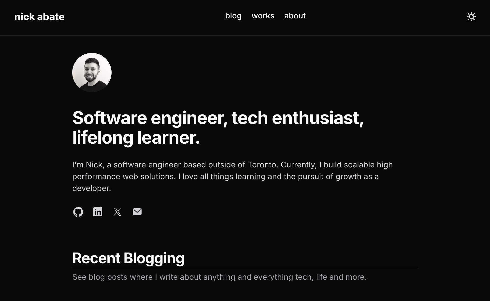

# Portfolio-Next

This is a brief regarding [my personal portfolio blog](https://nickabate.dev).  

Building a portfolio from scratch enabled me to practice creating a responsive mobile and desktop friendly design, prioritizing typography with a minimalist style.

Blog articles and works summaries are written in MDX, which seamlessly lets authors include JSX in their Markdown documents.

## Built with

- [React](https://reactjs.org/) - JS library for web user interfaces
- [Next.js](https://nextjs.org/) - React based web development framework
- [Tailwind CSS](https://tailwindcss.com/) - Utility first CSS framework
- [TypeScript](https://www.typescriptlang.org/) - Strongly typed programming language that builds on JavaScript
- [MDX](https://mdxjs.com/) - Seamlessly integrate JSX into Markdown content

## Author

Thanks for checking out my work! Feel free to reach out to me with any questions or to connect.

- Portfolio - [Live Site](https://nickabate.dev/)
- LinkedIn - [Nick Abate](https://www.linkedin.com/in/nick-abate/)
- Twitter - [@thatdevnick](https://twitter.com/thatdevnick)
